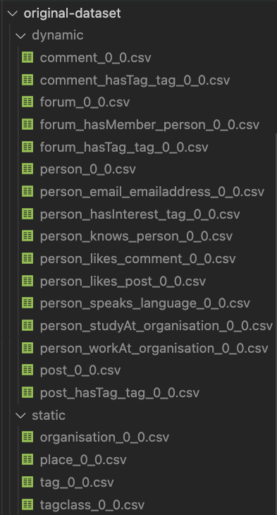

# schemaless-data-generator

For the design description, see [Schemaless Data Experiment on Orca](https://docs.google.com/document/d/1R7ENQvLVNHQ-DG-sga0tfgGWJIkobQT77HQFVKUvxH8/edit#).

## Setup

1. Create original-dataset folder
2. Copy dataset into the folder (dynamic, static folder)
    
    

## Folder Structure

```
./configuration: yaml files
./schemas: schema yaml files
```

## Bash files

```
runner.sh: move generated files and run the experiment.
```

## Configuration Files
```
table_name: <table name. e.g., comment, forum, person>
schema_file: <schema file path. e.g., ./schemas/comment.yaml>
data_file: <data file path. e.g., ./original-dataset/dynamic/comment_0_0.csv>
output_folders_path: <output folder path. e.g., ./generated-dataset/dynamic>
partitions: <partition names, e.g., [p1, p2, p3]>

# for each partition
<partition name>:
    portion: <portion of the data, 0 ~ 100 e.g., 20>
    column_removing:
        activate: <true or false>
        columns: <column names to remove, e.g., [id, creationDate]>
```

## Usage
```
python dataset-generator.py <configuration file path> <output format; csv or json>
```